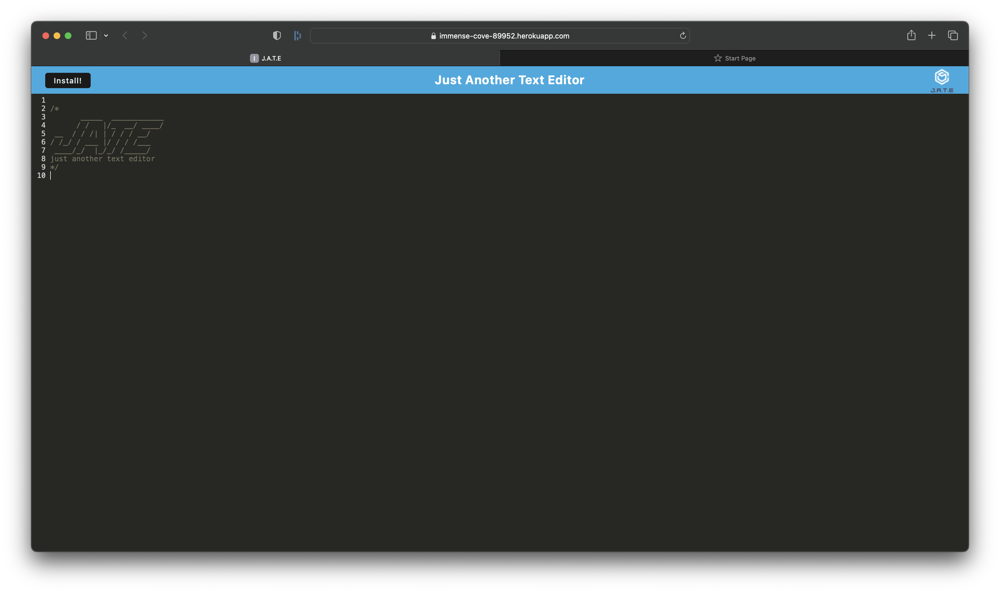

# PWA - Text Editor

  

  ## Table-of-Contents

  * [Description](#description)
  * [Installation](#installation)
  * [Usage](#usage)
  * [License](#license)
  * [Contributing](#contributing)
  * [Tests](#tests)
  * [Questions](#questions)
  
  ## [Description](#table-of-contents)

  This PWA application utilizes Node, express, various npm packages, nodemon, concurrently, and webpack to create a text editor application that you can use on the web, or install to your computer to use offline. All of the data is stored in an indexedDB and can be used on or offline.

  ## [Installation](#table-of-contents)

  To install this project, clone the repositoy, and run npm install to download the necessary packages. To run the project at your local, run npm start in your terminal.

  ## [Usage](#table-of-contents)

  To use this application, follow this [link](https://immense-cove-89952.herokuapp.com)

  The following image shows what the application will look like:
  
   
   

  ## [Contributing](#table-of-contents)
  
  
    Thank you for your interest contributing; however, right now, I will not be accepting outside contributions.
      

  ## [Questions](#table-of-contents)

  Please contact me using the following links:

  [GitHub](https://github.com/colint771)

  [Email: colint771@gmail.com](mailto:colint771@gmail.com)

